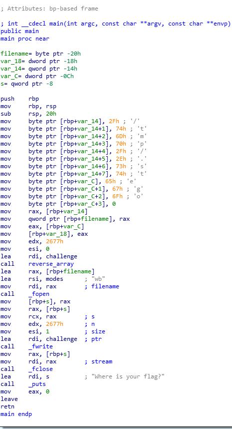

Writeup 7 - Forensics I
======

Name: Mike Bailey
Section: 0201

I pledge on my honor that I have not given or received any unauthorized assistance on this assignment or examination.

Digital acknowledgement of honor pledge: Mike Bailey

## Assignment 7 writeup

### Part 1 (40 pts)

1. JPEG image file

2. Chicago, Illinois. Taken from the 360 CHICAGO Observation Deck

3. August 22, 2018 11:33:24AM 

4. an iPhone 8 rear camera

5. 539.5 meters above sea level

6. `CMSC389R-{look_I_f0und_a_str1ng}` `CMSC389R-{abr@cadabra}`

### Part 2 (55 pts)

Taking a look at the binary, we see it's a standard Linux ELF executable. I noticed it's a `PIE` binary, which makes things a bit more difficult to reverse engineer, due to the unpredictable memory address it will be loaded into. This made setting breakpoints a pain without specialized tools- so I figured static analysis was the way to go here. Let's open this up in IDA:

I notice the path `/tmp/stego` right off the bat being pushed onto the stack. When trying to access the file, I couldn't seem to find it. I figured the binary was simply "storing" the file in `/tmp`, and I just needed to add a breakpoint before the program exited in order to get the file before it was removed. After doing some research on how PIE worked, I realized this was probably too difficult for this course's scope.

It took me a while to figure out why I wasn't able to find the file- it was really `/tmp/.stego`, and I had simply misread the path. Oh well, what's 20 minutes of confusion? Here's our `stego` file:

Looking at the .stego file, we get a nice JPEG image of a Stegosaurus. Taking the name of the file into consideration, along with Mike's hint about using `steghide`, I began bruteforcing passwords with `steghide` using a script available [here](https://github.com/Paradoxis/StegCracker). Letting it run for a couple of hours with the rockyou.txt dictionary, I get the password `stegosaurus`. After some cursing, I took a look at the extracted data.

The resulting hidden file contained our flag: `CMSC389R-{dropping_files_is_fun}`