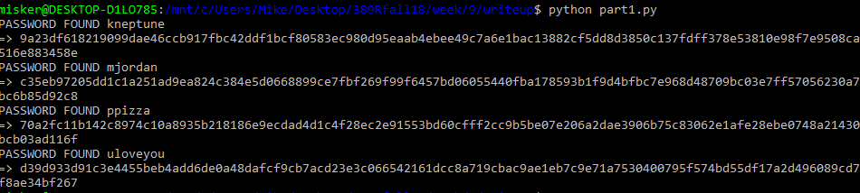
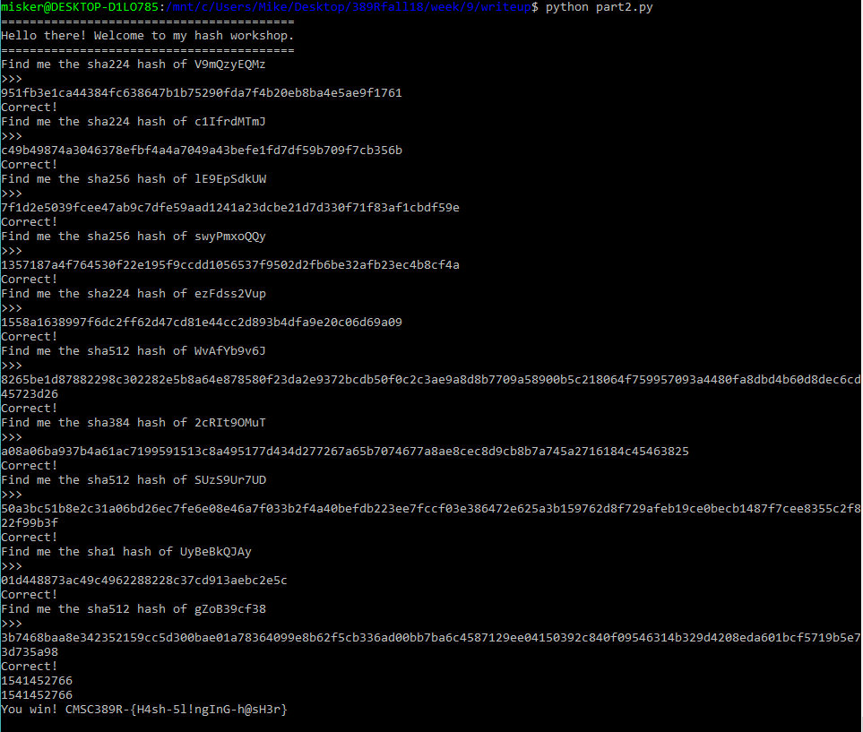

Writeup 9 - Crypto I
=====

Name: Mike Bailey
Section: 0201

I pledge on my honor that I have not given or received anyunauthorized assistance on this assignment or examination.

Digital acknowledgement of honor pledge: Mike Bailey

## Assignment 9 Writeup

### Part 1 (60 Pts)

I started off by trying to use these hashes + wordlist in hashcat. After realizing they weren't even the right format for salted SHA512 hashes for hashcat, I actually read the README. If I wanted to use hashcat, I was gonna need to build my own dictionary... So I figured at this point I mgiht as well just write the script.

Adding in a for loop to iterate over each word in addition to each printable character, we now had the main structure of the script. It would try every combination of [a-z] prepended to each password in the wordlist. Now we just needed to hash them! Noting that hashlib was already imported, I just usaed the built-in sha512 constructor, got the hex digest for each password/salt combo, and checked if the resulting hash was in the hash list. If it was, I printed out the password, salt, and hash. Done.

Oh yeah, the wordlist was in friggin HTML. Had to open it and pull out all the passwords by hand. I put those in `wordlist.txt`.

### Part 2 (40 Pts)

I spent way too long trying to figure out why my script was getting hung up after the first `socket.send()` call. Newlines. Newlines.

So we get the initial challenge, and then check to see what kinda hash digest its looking for. Enter a bunch of if-statements (does this count as ML?). We assign `resp` to be the resulting hash of each challenge, again using `hashlib`. Send that bad boy over the wire *with a newline at the end.*

Rinse and repeat until `"hash of"` is not present in the receieved  text. Alternatively, until we see `CMSC389R-{` in the recv'd text. Done-zo:  `CMSC389R-{H4sh-5l!ngInG-h@sH3r}`

